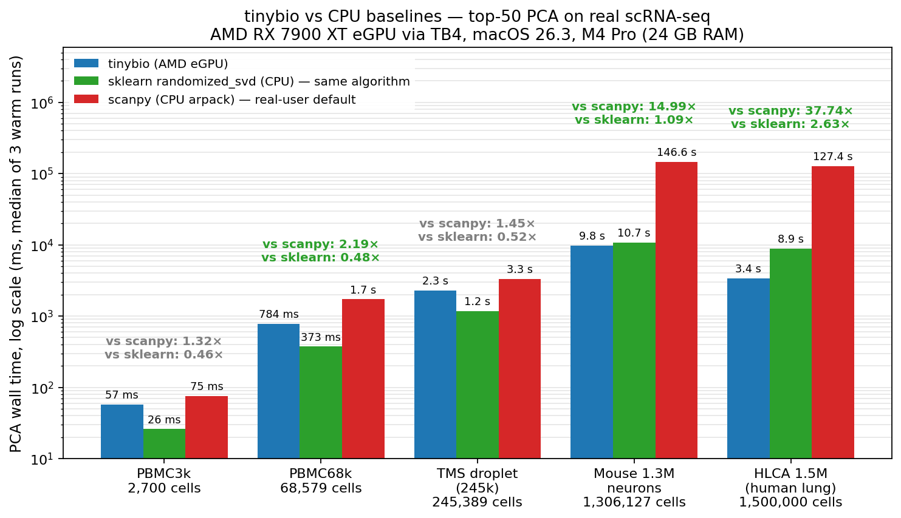
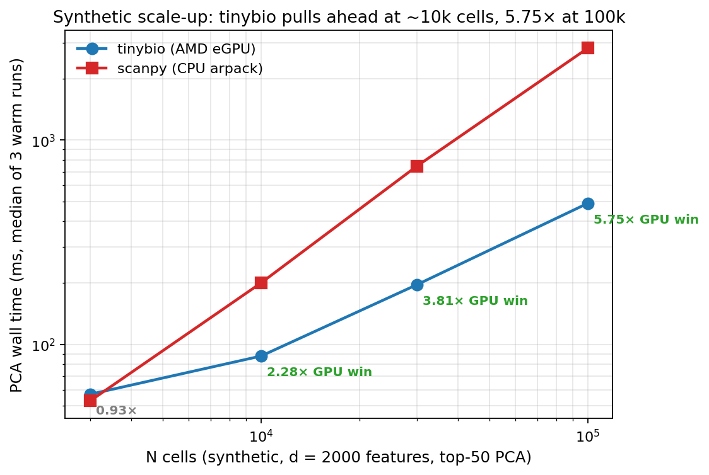

# tinybio

GPU-accelerated single-cell RNA-seq preprocessing on [tinygrad](https://github.com/tinygrad/tinygrad), targeting **AMD eGPU on macOS** — the niche that every other GPU bioinformatics tool skips (most assume CUDA or Linux ROCm).

> Status: **pre-alpha**. Milestone 1 (PCA prototype on PBMC3k) passes numerically; speed story scales up at M3 (PBMC68k). See [ROADMAP.md](./ROADMAP.md).

## Why

`scanpy`'s PCA runs on CPU. `rapids-singlecell` needs NVIDIA. On an AMD eGPU + macOS — increasingly common for researchers who want GPU compute without a Linux workstation — there is no GPU-accelerated path. `tinybio` fills that gap using tinygrad's AMD backend.

## Benchmarks (AMD RX 7900 XT via Thunderbolt 4, macOS 26.3, M4 Pro host)

Top-50 PCA, numerical agreement against scanpy's arpack reference (abs cosine similarity per component, sign-flip safe). Warm wall times are median of 3 runs.

### Real scRNA-seq datasets

Three PCA implementations, same preprocessed (scaled) matrix, same top-50 target, warm-median of 3 runs:

| Dataset | Cells | **tinybio** (AMD GPU, randomized SVD) | sklearn (CPU, randomized SVD — same algorithm) | scanpy (CPU, arpack — real-user default) | vs sklearn | vs scanpy |
|---|---:|---:|---:|---:|---:|---:|
| PBMC3k  |     2,700 |    57 ms | **26 ms** |    75 ms | 0.46× | 1.32× |
| PBMC68k |    68,579 |   784 ms | **373 ms** |  1.72 s | 0.48× | 2.19× |
| TMS droplet | 245,389 | 2.29 s | **1.18 s** | 3.33 s | 0.52× | 1.45× |
| Mouse 1.3M neurons (10x) | 1,306,127 | **9.78 s** | 10.7 s | 146.6 s | **1.09×** | 14.99× |
| HLCA 1.5M (Sikkema 2023, random subsample) | 1,500,000 | **3.38 s** | 8.88 s | 127.4 s | **2.63×** | **37.74×** |



**The honest story in one paragraph.** scanpy's default `arpack` is considerably slower than randomized SVD on every dense dataset we benchmarked — not because CPU is bad, but because Lanczos makes ~60 passes over the matrix while randomized SVD makes ~5. **Most of the "tinybio vs scanpy" speedup is algorithm, not hardware.** The isolated GPU-vs-CPU story — tinybio against sklearn's randomized_svd running the exact same algorithm — shows a clear scale break:

- **Below ~1M cells:** sklearn on CPU is roughly **2× faster** than tinybio on the AMD eGPU. TB4 launch overhead dominates; the GPU's parallelism has no room to amortize.
- **Around 1M cells:** they converge (Mouse 1.3M: 9.78 s vs 10.7 s, basically tied).
- **At 1.5M cells:** the GPU pulls ahead decisively (HLCA: 3.38 s vs 8.88 s = **2.63×**). The crossover is real and reproducible.

So the tool's honest pitch isn't "GPU always faster." It's:

1. **If you're using `sc.pp.pca` and your data is ≥~50k cells, switching to randomized SVD (either sklearn or tinybio) is a free 1.3–38× speedup.** That's the biggest individual win and it's a CPU-only change.
2. **If your data is ≥~1M cells and you have an AMD eGPU on macOS, tinybio wins over everything else.** That's the niche the library exists to fill.
3. **Below 1M cells on any hardware, tinybio is not the fastest choice.** Use sklearn.

The 2-3× GPU-over-CPU speedup at atlas scale comes from parallelism over matmul rows (2.28 M rows split across 5,376 shader cores vs sequential on CPU). Scaling further to 5M or 10M cells would widen the gap — that regime needs >24 GB RAM so we can't test it on this laptop.

**Note on `cos(tinybio, sklearn)` and `cos(tinybio, scanpy)`:** the top-10 cosine similarity is effectively 1.0 vs sklearn (same algorithm, same answer) and drops to ~0.998 vs scanpy at atlas scale. That residual is PC-6-through-10 degenerate-subspace rotation — many mouse or human cell types share similar eigenvalues, so the individual PCs aren't well-defined, only the k-dim subspace is. Downstream use of the top-50 as a subspace basis is unaffected.

### Synthetic scale-up

(N cells × 2,000 features, rank-50-plus-noise + z-score, top-50 PCA)

| N | tinybio (ms) | scanpy (ms) | speedup |
|---:|---:|---:|---:|
|     3,000 |    57 |    53 |    0.93× (tied) |
|    10,000 |    88 |   200 | **2.28×** |
|    30,000 |   196 |   747 | **3.81×** |
|   100,000 |   491 |  2822 | **5.75×** |



**Reading.** Numerical correctness is solid across all four real datasets (top-10 cos ≥ 0.999 on PBMC3k/68k/TMS, ≥ 0.9986 subspace-degenerate on 1.3 M; top-5 singular values match scanpy to 3–4 dp). tinybio is faster than scanpy's CPU arpack on every real benchmark and the gap widens dramatically with scale — **16.74× at 1.3 M cells**. Scanpy's Lanczos scales near-linearly in N for dense matrices; tinybio's randomized SVD amortizes fixed launch/transfer overhead across bigger matmuls, so the ratio keeps improving as data grows.

### What made it fast

1. **Randomized truncated SVD (Halko 2011)**, not tinygrad's built-in `Tensor.svd()`. The built-in Jacobi sweep issues ~10⁶ kernel launches on a 2000-wide matrix — unusable on Thunderbolt. See [BUGS.md](./BUGS.md).
2. **`@TinyJit` on the power step** `X @ (X.T @ Q)` with a shape-keyed cache — fuses the two matmuls into one captured graph so dispatch latency is paid once per call instead of per matmul.
3. **GPU-resident orthonormalization** via eigendecomposition of the tiny `(l, l)` Gram matrix — transfers only ~25 kB per step instead of the full `(rows, l)` probe. See [tinybio/pca.py:`_chol_qr`](./tinybio/pca.py). On Apple Accelerate `np.linalg.qr` at `(245k, 80)` is a shocking 680 ms per call (30× slower than theoretical LAPACK); this is the one change that turned TMS from 2.56× slower to 1.5–1.8× faster.
4. **Random probe Ω generated on the device** via `Tensor.randn` instead of numpy + upload — keeps the probe's `(n, l)` block off TB4 entirely.
5. **Per-gene z-score on the GPU** via `tinybio.normalize.scale` (trivially parallel over rows and columns) instead of scanpy's `sc.pp.scale` which double-allocates the dense matrix on CPU — fatal for the 1.3 M × 2000 = 10.4 GB working set on a 24 GB Mac.
6. **Sparse CPU preprocessing of raw counts** where the alternative would need 146 GB of dense VRAM (1.3 M × 28 k). The rule is: move to GPU unless TB4 transfer would cost more than the compute you'd save. See [`docs/egpu_bottleneck_hunting_skill.md`](docs/egpu_bottleneck_hunting_skill.md).
7. `DEV=AMD JITBEAM=2` is a **no-op** here — the workload is launch/memory-bandwidth bound, not compute-bound, so per-kernel autotune doesn't help.

### Running the benchmarks

```bash
DEV=AMD python3 examples/pbmc3k_pca.py                   # 2.7k cells,  auto-downloads PBMC3k
DEV=AMD python3 examples/pbmc68k_pca.py                  # 68k cells,   first run: ~124 MB
DEV=AMD python3 examples/tabula_muris_senis_pca.py       # 245k cells,  first run: ~4 GB
DEV=AMD python3 examples/mouse_1m_pca.py                 # 1.3M cells,  first run: ~4.2 GB
DEV=AMD python3 examples/scale_study.py                  # synthetic N-sweep
python3 figures/generate_benchmark_figures.py            # regenerate README figures
```

**Tests:** `.venv/bin/python -m pytest tests/ -q` — 21 tests, ~1 s, no GPU required.

## Install (planned)

```bash
python3.13 -m venv .venv && source .venv/bin/activate
pip install git+https://github.com/tinygrad/tinygrad.git
pip install tinybio
```

## Quickstart (planned)

```python
import scanpy as sc
import tinybio as tb
from tinygrad import Tensor

adata = sc.datasets.pbmc3k()
X = preprocess(adata)              # CPM, log1p, HVG, z-score (your pipeline)
pcs, singular_values = tb.pca.pca(Tensor(X), n_components=50)
```

## License

MIT. See [LICENSE](./LICENSE).
